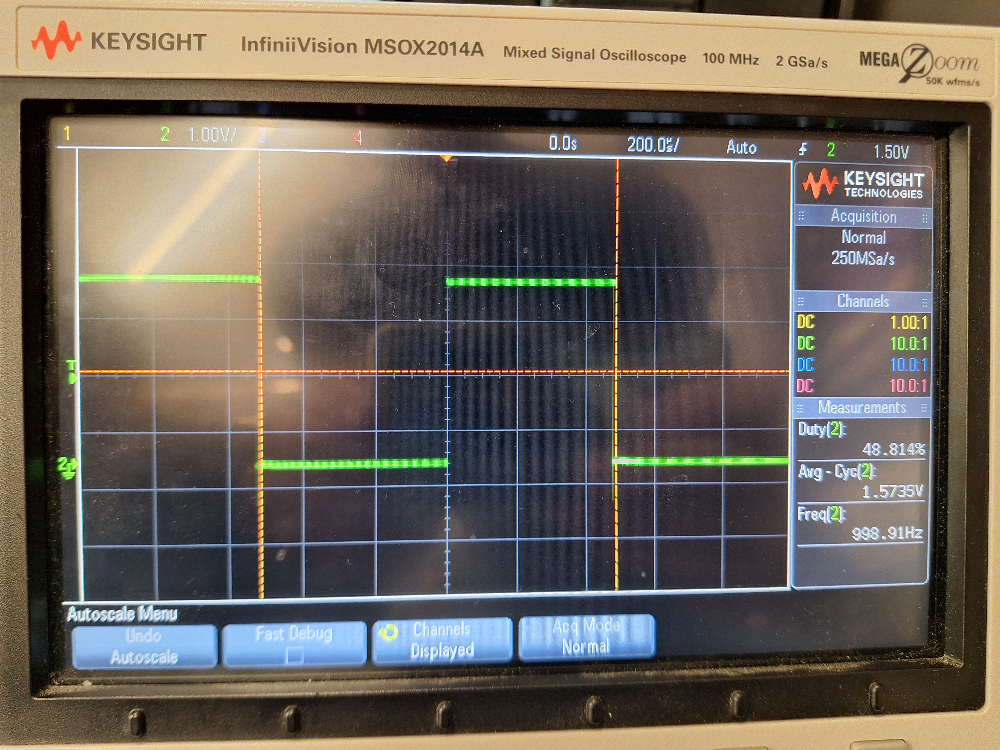

# PWM Signal Output using 16-bit Timer1 on 32U4

1. The objective of this hands-on assignment is to create a PWM signal output using the 16-bit Timer1 on the 32U4 processor. We wish to set up a PWM output at a frequency of 1kHz on either pin **OC1A** or **OC1B**. Since this is a 16-bit timer, some of the register settings are different than the example we did in class.

    a. Review the Timer1 registers starting on page 131 of the datasheet.  
    b. Be sure to set the relevant pins to outputs.  
    c. Set up **TCCR1A**, **TCCR1B**, and **TCCR1C** for **Fast PWM** (decide what you will use for **TOP**, clock prescaler, etc.). Try to optimize tick resolution time.  
    d. Set up **OCR1A/OCR1B** appropriately.  
       > Note: These are 16-bit registers, so they have a high and a low byte. The PWM duty cycle should initially be 50%.  
    e. Write the `loop` function that updates the duty cycle, counting from 0% to 100%, then back down to 0% (repeating). The delay between duty cycle changes should be **100ms**.  
    f. Implement a `#define` that allows the developer to change the **max duty cycle** to any value between 0% and 100%.  
    g. Use the **Digilent Discovery Waveform Application** in **Oscilloscope Mode** to screen capture your PWM signal and attach it to the assignment. Verify your design by observing the measurements (**DutyCycle, Average**, etc.) using the **Add Measure** feature of Waveforms, like we did in class.

# Solutions

I used **OCR1A** as the **TOP** value, and **OCR1B** as the **compare match (duty cycle)** register.

### Frequency Calculation

To generate a **1 kHz PWM signal**, I used the formula:

TOP = (Clock Frequency / (Prescaler × Target Frequency)) - 1

- **Clock frequency**: 8 MHz  
- **Prescaler**: 1  
- **Target frequency**: 1 kHz  
- **Resulting TOP (OCR1A)**: 7999

This configuration gives a **PWM frequency of 1 kHz**.

